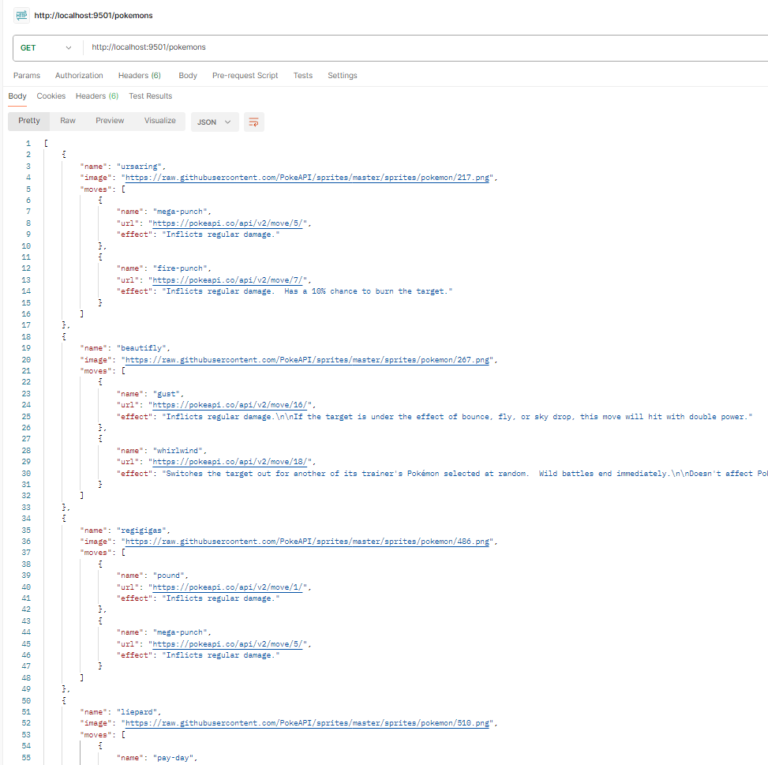
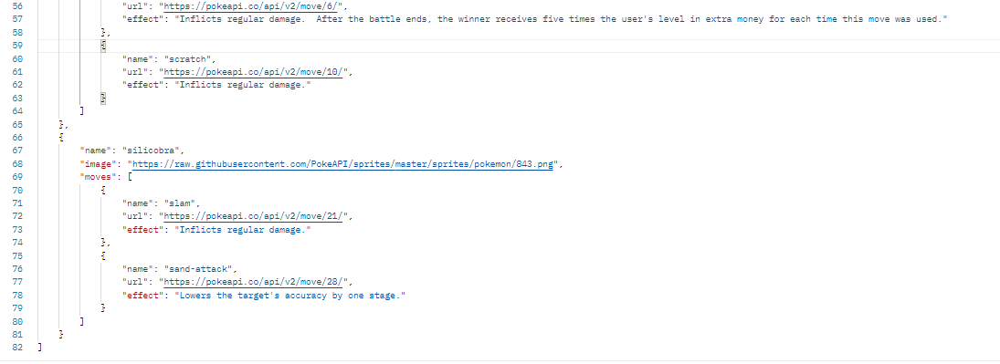

# Construa e Execute
1. Clone o Repositório
```
git clone https://github.com/isaquemenezes/pokemon-api-hyperf.git
cd pokemon-api-hyperf
```
2. Execute o Docker Compose para construir e iniciar o contêiner:
```
docker compose up --build
```

3. Instalar Dependências e Iniciar a Aplicação
```
composer install
php bin/hyperf.php start
```

4. Testar a Aplicação | navegador| Postman| Ferramenta como o curl:
```
curl http://localhost:9501/pokemons
```


## Tecnologias Utilizadas
- [Docker](https://docs.docker.com/)
- [Postman](https://www.postman.com/)
- [Visual Studio Code](https://code.visualstudio.com/)
- [WSl](https://learn.microsoft.com/en-us/windows/wsl/install)  
- [Git](https://git-scm.com/)
- [GiHub](https://github.com/)
- [Hyperf](https://hyperf.wiki/3.1/#/en/)
- [PHP | 8.1.27 ](https://www.php.net/)
- [Composer](https://getcomposer.org/)

## Referências:
- [Coroutines. O que são corrotinas | Dias de Dev](https://www.youtube.com/watch?v=Nbt0eQHChoI)
- [hyperf](https://hyperf.wiki/3.1/#/en/quick-start/install)
- [hyperf Corrotina | traducao,por GoogleTranslate ](https://hyperf.wiki/3.1/#/en/coroutine)
- [Pokemon API](https://pokeapi.co/api/v2/pokemon)

## Resultados
- [Link da Apresentação no google drive](https://drive.google.com/file/d/1xTqGtHlrykXdyweLJyfO9hQct-l71BPw/view?usp=sharing)





## Desafio:
<p>
Gostaria de uma funcionalidade onde posso apertar um botão e 5 pokemons sejam
escolhidos simultaneamente e aleatoriamente. Ao serem escolhidos, preciso ver:

1. <b> Nome do Pokemon</b> <br>
2. <b> Uma imagem</b> <br>
3. <b> Seus movimentos</b> <br>
4. <b> Efeitos de seus movimentos</b> <br>
</p>
<p>
Como Satoshi deseja que sua aplicação seja muito rápida, solicitou que tudo ocorra em uma
única chamada de api da aplicação dele, ou seja, o desenvolvedor deve coordenar as
chamadas na api Pokemon e retornar as informações de uma única vez, conforme diagrama
ao final.</p>

<p>
Satoshi viu que existe um framework de PHP chamado Hyperf em https://hyperf.io/. Após ler
sobre corrotinas e waitgroups decidiu que sua aplicação precisa ter uso coordenado de
corrotinas para aproveitar cada segundinho de espera de operação de I/O
</p>
